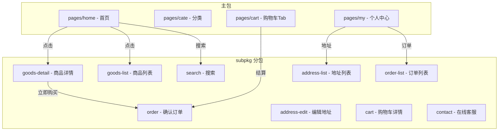
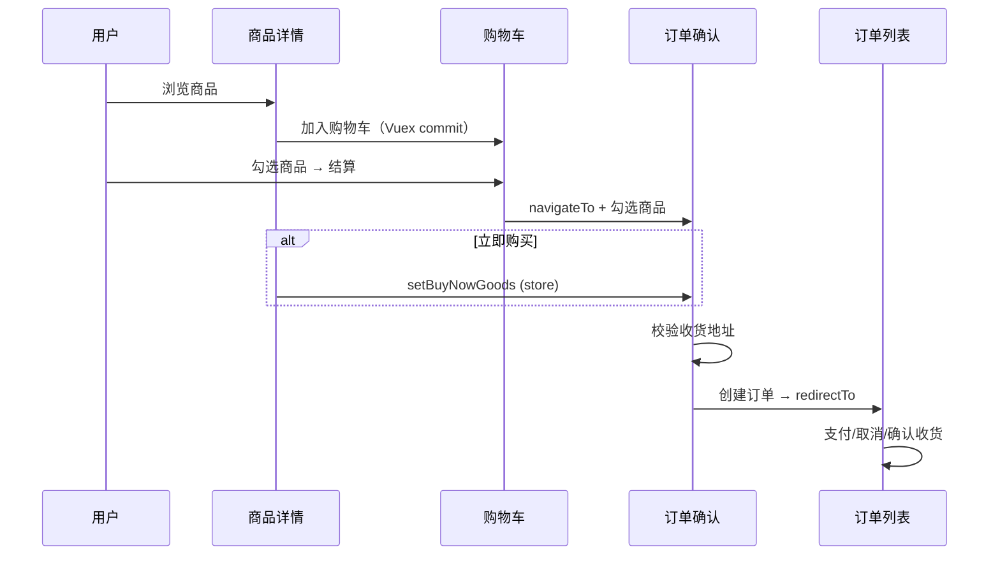
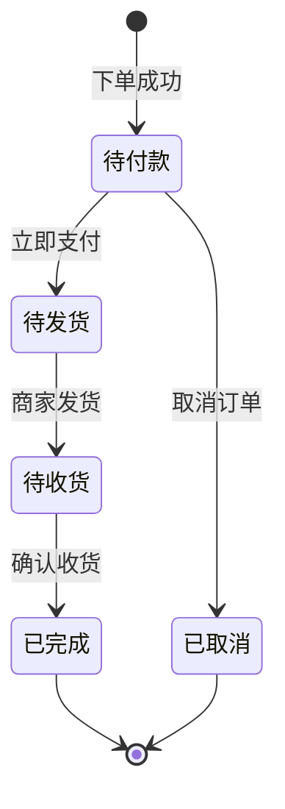

# ☀️ Sunny优购 (Sunny Yougou)

[](https://uniapp.dcloud.io/)
[](https://vuejs.org/)
[](https://developers.weixin.qq.com/miniprogram/dev/framework/)
[](https://opensource.org/licenses/ISC)
[](https://github.com/MrYangMrYangMrYang/uni_shop/actions/workflows/ci.yml)
[](https://vitest.dev/)

> 一款基于 **Uni-app** 框架开发的移动端电商微信小程序，实现完整的购物流程

---

## 📑 目录

- [📖 项目简介](#intro)
- [🚀 项目特性](#features)
- [📌 功能边界说明](#boundary)
- [🛠️ 技术栈](#tech-stack)
- [📦 核心功能模块](#modules)
- [🏗️ 架构设计](#architecture)
- [🔦 技术亮点](#highlights)
- [❓ 面试 FAQ](#interview-faq)
- [📂 目录结构](#structure)
- [🏃 快速开始](#quick-start)
- [🚢 发布流程](#deployment)
- [⚙️ 项目配置说明](#config)
- [📝 开发指南](#dev-guide)
- [❓ 常见问题 (FAQ)](#faq)
- [🤝 贡献指南](#contributing)
- [📄 开源协议](#license)
- [🙏 致谢](#acknowledgements)
- [📮 联系方式](#contact)

---

<a id="intro"></a>

## 📖 项目简介

`Sunny优购` 是一款功能完整的电商微信小程序，采用经典的电商布局设计。项目实现了从**商品浏览、搜索、分类**到**购物车管理、收货地址管理、订单支付及在线客服**的完整购物流程，为用户提供流畅便捷的移动端购物体验。

### ✨ 核心亮点

- 🚀 **跨平台兼容**：基于 Uni-app 开发，可编译至微信小程序、H5、App 等多个平台
- ⚡ **性能优化**：分包加载策略 + 瀑布流布局 + 骨架屏体系 + 首页三接口并发
- 🔐 **安全可靠**：Token 机制登录 + 微信原生接口集成 + 登录守卫
- 🎨 **交互丰富**：二级联动导航、滑动删除、实时搜索建议、瀑布流布局
- 🏗️ **DRY 架构**：共享购物车组件消除双页 ~70% 重复代码
- 🎯 **设计令牌**：60+ SCSS 变量，全项目统一引用
- ♿ **无障碍**：aria-label / role 等属性标注关键交互元素
- 🛡️ **防御性设计**：全局错误边界 + 网络异常兜底 + 重试恢复机制
- 📦 **演示数据中心**：src/config/mock.js 集中管理所有 mock 数据，关注点分离
- 💰 **价格精度**：内部整数分存储，消除浮点精度问题（前端经典考点）

---

<a id="features"></a>

## 🚀 项目特性

### 跨平台与性能

- **跨平台兼容**：基于 Uni-app 开发，可编译至微信小程序、H5、App 等多个平台
- **分包加载优化**：核心 TabBar 页面位于主包，搜索、详情、订单等功能模块位于 `subpkg` 分包，显著提升首屏加载速度
- **性能监控体系**：请求计时、页面加载追踪、包体积分析脚本

### 高性能交互体验

- **瀑布流布局**：商品列表采用左右双列瀑布流展示，视觉体验更佳
- **二级联动**：分类页面实现左侧导航与右侧内容的流畅联动
- **骨架屏体系**：3 种模式（list/card/detail）× 4 个核心页面，shimmer 动画

### 状态管理与数据持久化

- 通过 **Vuex** 实现购物车状态、用户信息、收货地址、错误状态的全局共享与持久化存储
- 模块化状态管理：`m_cart`（购物车）、`m_user`（用户信息）、`m_error`（全局错误）
- **自研持久化插件**：声明式配置替代手写 `saveXxxToStorage`

### 错误处理体系

- **全局错误边界**：页面级 `error-boundary` mixin，API 失败自动展示 fallback UI + 重试
- **网络异常兜底**：首页/分类/详情/列表/搜索 5 个核心页面接入 `u-network-error` 组件
- **双重 toast 修复**：统一 `handleRequestError` 为唯一 toast 出口
- **定时器清理**：`my-settle` 倒计时组件 `beforeDestroy` 防泄漏

### 价格精度方案

- **内部整数分存储**：所有 `goods_price` 为整数分，`goods_count × goods_price` 纯整数运算
- **API 边界自动转换**：响应拦截器元→分，请求拦截器分→元，递归处理嵌套对象
- **全局 `formatPrice` filter**：`{{ price | formatPrice }}` → `￥XX.XX`
- **启动数据迁移**：自动检测并转换本地存储中的旧 float-元数据

### 微信深度集成

- ✅ 支持 **微信一键登录**（Token 机制）
- ✅ 对接 **微信原生收货地址** 接口
- ✅ 模拟 **微信支付** 完整流程
- ✅ 内置 **在线客服** 聊天系统

---

<a id="boundary"></a>

## 📌 功能边界说明

> 本项目为**前端求职展示项目**，聚焦前端工程化与交互实现。以下模块为演示性质或受后端接口限制，并非完整生产实现。面试官可据此准确评估项目完成度。

### 🟡 演示性质功能

| 模块         | 实现状态     | 说明                                                                                                                                                                                                    |
| ------------ | ------------ | ------------------------------------------------------------------------------------------------------------------------------------------------------------------------------------------------------- |
| 微信支付     | 流程演示     | [my-settle.vue](./components/my-settle/my-settle.vue) 中的 `payOrder` 方法完整实现了"创建订单 → 获取预支付参数 → 发起微信支付 → 验证支付结果"四步流程，但因后端接口需商户号配置，未在结算按钮中实际调用 |
| 物流查询     | Mock 数据    | [order-list.vue](./subpkg/order-list/order-list.vue) 使用 [mock.js](./src/config/mock.js) 中的 `DEMO_LOGISTICS` 演示时间线                                                                              |
| 客服系统     | 自动回复模拟 | [contact.vue](./subpkg/contact/contact.vue) 通过 setTimeout 模拟客服回复，未接入 IM SDK                                                                                                                 |
| 商品规格选择 | UI 演示      | 商品详情页未实现 SKU 多维规格选择                                                                                                                                                                       |
| 地区选择     | 微信原生     | [address-edit.vue](./subpkg/address-edit/address-edit.vue) 使用微信原生 `<picker mode="region">` 组件                                                                                                   |
| 个人中心统计 | Demo 数据    | 参见 [mock.js](./src/config/mock.js) `DEMO_USER_STATS`                                                                                                                                                  |

### 🟠 环境限制说明

- **登录 Token**：[my-login.vue](./components/my-login/my-login.vue) 因演示环境后端接口限制，使用 [mock.js](./src/config/mock.js) 中的 `DEMO_TOKEN`。生产环境应替换为接口返回的真实 Token，并配合 [request.js](./src/utils/request.js) 的 401 拦截器实现自动续期
- **API 地址**：使用 itheima 商城公开测试接口，仅供学习演示，请勿用于生产
- **manifest.json** 中 `urlCheck: false` 仅用于开发调试，生产环境必须开启

### 🟢 完整闭环功能

以下功能为**真实可用**的完整业务闭环：

- 商品浏览（首页楼层、分类二级联动、商品列表瀑布流、商品详情）
- 购物车（增删改查、全选、滑动删除、合计计算、本地持久化）
- 收货地址管理（新增、编辑、删除、默认地址排他、微信导入、重复地址拦截）
- 订单列表（状态分类、支付倒计时、订单生命周期操作）
- 搜索（历史记录、搜索建议、防抖、去重）
- 用户登录（微信授权、Token 持久化、退出登录、登录守卫）

---

<a id="tech-stack"></a>

## 🛠️ 技术栈

| 技术                                                                                     | 版本/说明  | 用途                      |
| ---------------------------------------------------------------------------------------- | ---------- | ------------------------- |
| [Uni-app](https://uniapp.dcloud.io/)                                                     | Vue.js 2.x | 核心开发框架              |
| [Vuex](https://vuex.vuejs.org/)                                                          | 3.x        | 全局状态管理 + 自研持久化 |
| [@escook/request-miniprogram](https://www.npmjs.com/package/@escook/request-miniprogram) | ^0.2.1     | 网络请求封装              |
| SCSS (Sass)                                                                              | -          | 60+ 令牌设计系统          |
| uni-ui                                                                                   | -          | UI 组件库基础             |
| [Vitest](https://vitest.dev/)                                                            | ^1.0       | 单元测试框架              |
| [miniprogram-automator](https://developers.weixin.qq.com/miniprogram/dev/devtools/auto/) | ^0.12      | E2E 自动化测试            |
| [ESLint](https://eslint.org/) + [Prettier](https://prettier.io/)                         | ^8 + ^3    | 代码规范 + 格式化         |
| [husky](https://typicode.github.io/husky/) + [commitlint](https://commitlint.js.org/)    | ^8 + ^18   | Git hooks + 提交规范      |
| [GitHub Actions](https://github.com/features/actions)                                    | -          | CI 自动 lint + test       |

---

<a id="modules"></a>

## 📦 核心功能模块

### 1️⃣ 首页 (Home)

- **轮播图展示**：动态运营位，支持自动轮播
- **分类导航**：快捷入口直达商品分类
- **楼层推荐**：精选商品分模块展示
- **网络兜底**：API 失败时展示错误页 + 重试按钮

### 2️⃣ 商品分类 (Category)

- **左右联动导航**：左侧分类列表 + 右侧商品内容
- **点击定位**：支持快速定位到指定分类
- **网络兜底**：API 失败时展示错误页 + 重试按钮

### 3️⃣ 搜索系统 (Search)

- **实时联想**：输入关键词实时显示建议（防抖处理）
- **搜索历史**：本地存储历史记录，支持一键清空
- **热门推荐**：展示热门搜索关键词

### 4️⃣ 购物流程 (Shop Flow)

#### 商品详情页

- 富文本渲染商品详情
- 图片大图预览功能
- 骨架屏加载态 + 网络错误兜底

#### 购物车

- 左滑删除商品（uni-swipe-action）
- 商品数量调整（uni-number-box）
- 全选/反选计算总价（纯整数分运算）
- TabBar 实时徽标同步
- 结算按钮防抖 + 登录守卫 + 未登录 3 秒倒计时跳转

#### 地址管理系统

- 手动编辑收货地址
- 微信导入收货地址（一键获取）

#### 订单系统

- 订单确认与下单
- 订单列表按状态分类展示
- 订单状态流转（待付款/待发货/待收货/已完成）
- 待付款订单支付倒计时 + 自动过期清理
- 金额以整数分存储，显示时通过 `formatPrice` filter 转换

### 5️⃣ 在线客服 (Contact)

- **即时通讯**：模拟客服自动回复系统
- **智能导购**：提供贴心的购物咨询服务

---

<a id="architecture"></a>

## 🏗️ 架构设计

### 分包结构



### 购物流程时序



### 订单状态机



---

<a id="highlights"></a>

## 🔦 技术亮点

> 面试官最关心的技术决策，逐一说明

### 1. 网络层架构

基于 `@escook/request-miniprogram` 二次封装，补齐了以下企业级能力：

| 能力             | 实现                                                      |
| ---------------- | --------------------------------------------------------- |
| Token 自动注入   | `beforeRequest` 拦截器，`/my/` 路径自动携带 Authorization |
| 401 自动跳登录   | `afterRequest` 拦截器 + 防抖（5s 超时自动复位）           |
| Loading 引用计数 | 并发请求共享一个 loading，最后完成才关闭                  |
| 错误码映射       | 400/401/403/404/500/502/503/504 → 用户友好文案            |
| 超时提示         | 网络超时/断网分别给出针对性提示 + 提交 error state        |
| 价格边界转换     | 响应拦截器 元→分，请求拦截器 分→元，递归处理嵌套对象      |
| 请求性能计时     | `beforeRequest` / `afterRequest` 自动记录接口耗时         |
| API 分层         | `src/api/home.js` / `src/api/goods.js` 按业务域组织       |

### 2. 自研持久化插件

替代每个模块手写 `saveXxxToStorage` 的样板代码，通过 Vuex plugin + `store.subscribe` 实现声明式持久化：

```javascript
// src/store/store.js — 一行配置替代 6 个存储函数
createPersistedState({
	paths: {
		'm_cart.cart': 'cart',
		'm_user.token': 'token'
		// ...
	}
});
```

初始化时自动从 Storage 恢复到 state，mutation 命中时自动写入 Storage。支持嵌套路径、损坏数据降级。

### 3. 演示数据集中管理

所有前端写死的演示数据统一收敛到 `src/config/mock.js`，每个数据项附带注释说明：

- 为何需要 mock（后端接口限制 / 非核心功能）
- 生产环境应如何替换（API 端点 / store getter）

涉及：登录 Token、用户统计数据、品牌/店铺列表、热搜词、物流追踪。这替代了原先散落在 5 个组件中的"裸硬编码"，体现了 **关注点分离** 原则。

### 4. 价格精度方案（前端经典面试考点）

**问题**：`0.1 + 0.2 !== 0.3`，电商金额用浮点数直接运算会产生精度误差。

**方案**：全部金额以**整数分**存储，通过 API 边界拦截器完成自动转换：

```
后端 API (元) ──响应拦截器: yuanToFen()──→ Store (整数分) ──formatPrice filter──→ 模板显示 ￥XX.XX
模板操作 ──不变──→ Store (整数分) ──请求拦截器: fenToYuan()──→ 后端 API (元)
```

`3 × 333分 = 999分` 永远精确，不依赖于 `Number.toFixed()`。

### 5. 全局错误边界

从 API 层到页面的完整错误处理链路：

```
request.js 拦截器 → m_error/setError → error-boundary mixin → u-network-error 组件
```

- **5 个核心页面**接入 `<u-network-error>` fallback UI + 重试按钮
- `withErrorBoundary()` 包装异步请求，失败自动 commit error state
- 下拉刷新自动触发重试
- 修复了双重 toast 问题（`afterRequest` 不再弹 toast，统一由 `handleRequestError` 处理）
- 修复了 `my-settle` 倒计时定时器泄漏（新增 `beforeDestroy` 清理）

### 6. 骨架屏体系

自研 `u-skeleton` 组件，3 种模式（list/card/detail）× 4 个核心页面（home/cate/goods-list/goods-detail），shimmer 动画 + SCSS 变量统一管理。

### 7. 性能优化

| 优化项             | 实施                                                   |
| ------------------ | ------------------------------------------------------ |
| 首页三接口并发     | `await Promise.all([...])` 替换 3 个串行 await         |
| 订单定时器按需启停 | 仅 `status===0` 订单存在时运行 `setInterval`           |
| 图片懒加载         | `u-image` 组件默认 `lazy-load="true"`                  |
| 请求性能计时       | request.js 拦截器自动记录接口耗时                      |
| 页面加载追踪       | `src/utils/perf.js` perfStart/perfEnd 记录页面加载耗时 |
| 包体积分析         | `npm run analyze:size` → 目录占比 + 超限检查           |

### 8. 测试体系

**单元测试**：109 条用例覆盖 utils / store / mixins / components 四个维度。

**E2E 测试**：基于 miniprogram-automator，覆盖"首页 → 搜索 → 详情 → 加购 → 结算"完整购物流程（需微信开发者工具）。`npm run test:e2e`

**无障碍**：`goods-detail.vue` 作为 A11y 示范页面，标注了 aria-label / role 等关键交互属性。

| 维度           | 覆盖                                                          |
| -------------- | ------------------------------------------------------------- |
| **utils**      | price(25) + persist(7) + request(18) + toast(8)               |
| **store**      | cart(20) + user(20) + error(13)                               |
| **mixins**     | auth-guard(5) + error-boundary(14)                            |
| **components** | my-settle(13) + my-goods(9) + u-empty(9) + u-network-error(5) |
| **总计**       | **13 测试文件，166 条用例**                                   |

### 9. 购物车共享组件架构

`pages/cart`（TabBar）和 `subpkg/cart`（内部跳转）两个购物车页面原本存在 ~70% 重复代码。重构后提取出 `my-cart-content` 共享组件：

- **共享逻辑**：Vuex 映射、商品列表渲染、结算栏、空状态、侧滑删除
- **差异化通过 Props 控制**：`swipeDeleteStrategy`（'direct' | 'confirm'）、`primaryColor`
- **各页面仅保留独特职责**：TabBar 页的登录守卫 + 角标同步；分包页的自定义导航栏样式

这体现了 **DRY（Don't Repeat Yourself）** 原则在实际项目中的应用。

---

<a id="interview-faq"></a>

## ❓ 面试 FAQ

<details>
<summary><b>为什么用 Vue 2 而不是 Vue 3？</b></summary>

本项目基于 **Uni-app** 框架开发，受限于 uni-app 生态和微信小程序运行时。另有独立的 Vue 3 + TypeScript 项目覆盖现代技术栈。

</details>

<details>
<summary><b>为什么用 Vuex 而不是 Pinia？</b></summary>

Vuex 3.x 是 Vue 2 生态的标准状态管理方案。自研的持久化插件正是基于 Vuex plugin 机制实现的——这恰好展示了"理解原理"而非"只会用工具"的深度。

</details>

<details>
<summary><b>网络层解决了什么问题？</b></summary>

在 `@escook/request-miniprogram` 基础上补齐了 **Token 自动注入**、**401 拦截跳登录**、**全局 loading 引用计数**、**错误码→用户文案映射**、**价格 元↔分 自动转换**、**请求性能计时** 6 项能力。详见上方"技术亮点"第 1 点。

</details>

<details>
<summary><b>项目中有哪些技术难点值得一说？</b></summary>

1. **自研持久化插件**：Vuex plugin 中处理嵌套 state 路径的 get/set、初始化恢复、mutation 触发精确写入
2. **价格精度方案**：API 边界递归转换 + Store 纯整数运算 + 全局 filter，覆盖 14+ 处模板显示
3. **全局错误边界**：mixin + Vuex store + fallback 组件的三层架构，兼顾可复用性和简洁性

</details>

<details>
<summary><b>如何保证代码质量？</b></summary>

- **ESLint + Prettier**：0 errors
- **husky + commitlint**：commit 自动校验格式 + Conventional Commits
- **GitHub Actions**：Push → 自动 lint:check + format:check + vitest run
- **Vitest**：13 测试文件 / 166 用例，覆盖 utils、store、mixins、components
- **E2E**：基于 miniprogram-automator 的完整购物流程端到端测试
- **SCSS 令牌规范化**：80+ SCSS 设计令牌，全项目引用变量而非硬编码值
- **DRY 架构**：my-cart-content 共享组件消除双页重复代码
- **条件编译 ESLint 插件** `eslint-plugin-uni-conditional`：自研，处理 uni-app 的 `#ifdef VUE3` / `#endif` 编译指令

</details>

---

<a id="structure"></a>

## 📂 目录结构

```text
uni_shop/
├── src/                      # 业务模块集中管理
│   ├── api/                  #   API 接口层（按业务域组织）
│   │   ├── goods.js
│   │   └── home.js
│   ├── config/               #   环境配置 + Mock 数据中心
│   │   ├── env.js            #     环境配置（含 perfLog 和采样率）
│   │   └── mock.js           #     演示数据中心
│   ├── mixins/               #   逻辑混入
│   │   ├── auth-guard.js     #     登录守卫 mixin
│   │   ├── custom-navbar.js  #     自定义导航栏 mixin
│   │   ├── error-boundary.js #     错误边界 mixin（withErrorBoundary + retry）
│   │   └── tabbar-badge.js   #     TabBar 购物车角标 mixin
│   ├── store/                #   Vuex 状态管理
│   │   ├── cart.js           #     购物车模块（整数分运算）
│   │   ├── error.js          #     全局错误状态模块
│   │   ├── store.js          #     Store 入口 + 持久化插件
│   │   └── user.js           #     用户 / 地址 / 订单模块
│   └── utils/                #   工具模块
│       ├── toast.js          #     Toast 工具（替代全局 uni.$showMsg）
│       ├── perf.js           #     性能监控工具
│       ├── persist.js        #     Vuex 持久化插件
│       ├── price.js          #     价格工具（元↔分 + formatPrice + 迁移）
│       └── request.js        #     HTTP 封装（拦截器 + 价格转换 + 计时）
├── components/               # 组件（easycom 自动扫描）
│   ├── my-cart-content/      #   共享购物车组件（DRY）
│   ├── my-order-panel/       #   订单状态面板
│   ├── my-address/           #   收货地址组件
│   ├── my-goods/             #   商品组件（formatPrice filter）
│   ├── my-login/             #   登录组件
│   ├── my-search/            #   搜索组件
│   ├── my-settle/            #   结算组件（防抖 + 定时器清理）
│   ├── my-userinfo/          #   用户信息组件
│   ├── u-empty/              #   空状态组件（5 种 mode）
│   ├── u-image/              #   增强图片组件（懒加载 + 错误兜底）
│   ├── u-network-error/      #   网络异常兜底组件（5 个页面接入）
│   ├── u-skeleton/           #   骨架屏组件（3 种模式 × 4 页面）
│   ├── uni-goods-nav/        #   商品导航组件
│   ├── uni-icons/            #   图标组件
│   ├── uni-number-box/       #   数字输入框组件
│   ├── uni-search-bar/       #   搜索栏组件
│   ├── uni-swipe-action/     #   滑动操作组件
│   └── uni-swipe-action-item/#   滑动操作项组件
├── tests/                    # 测试统一管理
│   ├── unit/                 #   单元测试（utils / store / mixins / components）
│   │   ├── components/
│   │   ├── mixins/
│   │   ├── store/
│   │   ├── utils/
│   │   └── setup.js          #     全局 mock（uni/wx/Storage）
│   └── e2e/                  #   E2E 端到端测试
│       ├── full-flow.spec.js #     完整购物流程测试
│       └── setup.js          #     环境启动配置
├── pages/                    # 主包页面（TabBar）
│   ├── home/                 #   首页（网络兜底 + skeleton）
│   ├── cate/                 #   分类页（网络兜底）
│   ├── cart/                 #   购物车页
│   └── my/                   #   个人中心页
├── subpkg/                   # 分包页面
│   ├── address-edit/         #   编辑地址（含重复校验）
│   ├── address-list/         #   地址列表（含微信导入去重）
│   ├── cart/                 #   购物车详情
│   ├── contact/              #   在线客服
│   ├── goods-detail/         #   商品详情（网络兜底 + skeleton）
│   ├── goods-list/           #   商品列表（网络兜底 + skeleton）
│   ├── order/                #   订单确认（整数分存储）
│   ├── order-list/           #   订单列表（formatPrice filter）
│   └── search/               #   搜索页（网络兜底）
├── static/                   # 静态资源
├── scripts/                  # 构建脚本
│   └── analyze-bundle.js     #   包体积分析脚本
├── eslint-plugin-uni-conditional/  # 自研 ESLint 插件
├── App.vue                   # 应用入口（全局错误捕获 + 性能计时）
├── main.js                   # 主入口（formatPrice filter + 数据迁移）
├── pages.json                # 页面路由配置
├── manifest.json             # 应用配置（AppID、权限等）
├── uni.scss                  # 全局 SCSS 变量（60+ 设计 Token）
├── commitlint.config.js      # Commitlint 配置
├── vitest.config.js          # Vitest 配置
└── package.json              # 项目依赖配置
```

---

<a id="quick-start"></a>

## 🏃 快速开始

### 环境要求

- **Node.js**: >= 12.0.0
- **HBuilderX**: 最新版本（推荐）
- **微信开发者工具**: 最新版本
- **npm / yarn / pnpm**: 包管理器

### 安装步骤

#### 1. 克隆项目

```bash
# 使用 Git 克隆
git clone https://github.com/MrYangMrYangMrYang/uni_shop.git

# 进入项目目录
cd uni_shop
```

#### 2. 安装依赖

```bash
# 使用 npm
npm install

# 或使用 yarn
yarn install

# 或使用 pnpm
pnpm install
```

#### 3. 运行测试

```bash
# 运行全部测试
npm test

# 测试覆盖率
npm run test:coverage

# 包体积分析
npm run analyze:size
```

#### 4. 配置开发环境

1. 使用 **HBuilderX** 打开项目文件夹
2. 配置微信开发者工具路径：
   - `工具` -> `设置` -> `运行配置` -> `微信开发者工具路径`
3. 在 `manifest.json` 中配置微信小程序 AppID（如需真机调试）

#### 5. 运行项目

```bash
# 方式一：通过 HBuilderX 运行
# 点击菜单：运行 -> 运行到小程序模拟器 -> 微信开发者工具

# 方式二：通过 CLI 运行（需安装 cli）
npm run dev:mp-weixin
```

> ⚠️ **注意**：请在微信开发者工具中开启"不校验合法域名、web-view（业务域名）、TLS版本以及 HTTPS 证书"

---

<a id="deployment"></a>

## 🚢 发布流程

本项目基于 uni-app 开发，编译目标为微信小程序。发布 = 编译 → 上传 → 微信后台审核。

### 发布前检查清单

- [ ] `npm run lint:check` 零错误
- [ ] `npm test` 全部通过
- [ ] `npm run analyze:size` 包体积不超限（主包 2MB / 分包 2MB）
- [ ] `manifest.json` 中 `mp-weixin.setting.urlCheck` 设为 `true`
- [ ] `src/config/env.js` 中 `apiBaseUrl` 指向生产环境接口

### 发布步骤

```bash
# 1. HBuilderX 生产编译
#    菜单：发行 -> 小程序-微信 -> 填写版本号 -> 编译
#    产物：unpackage/dist/build/mp-weixin

# 2. 微信开发者工具
#    打开编译产物 -> 上传 -> 填写版本描述

# 3. 微信公众平台
#    mp.weixin.qq.com -> 版本管理 -> 提交审核 -> 发布
```

### CI 保障

每次 push 到 `main` 自动执行 lint → 格式检查 → 单元测试 + 覆盖率 → 包体积检查。详见 [ci.yml](./.github/workflows/ci.yml)。

---

<a id="config"></a>

## ⚙️ 项目配置说明

### 微信小程序配置 ([manifest.json](manifest.json))

| 配置项               | 值                 | 说明                     |
| -------------------- | ------------------ | ------------------------ |
| appid                | 请替换为你的 AppID | 微信小程序 AppID         |
| urlCheck             | false              | 关闭域名校验（开发环境） |
| lazyCodeLoading      | requiredComponents | 按需注入组件             |
| requiredPrivateInfos | chooseAddress      | 申请收货地址权限         |

### 网络请求超时配置

- request: 60s
- connectSocket: 60s
- uploadFile: 60s
- downloadFile: 60s

---

<a id="dev-guide"></a>

## 📝 开发指南

### 状态管理 (Vuex)

项目使用 Vuex 进行全局状态管理，主要包含三个模块：

#### 购物车模块 ([cart.js](./src/store/cart.js))

- 商品列表管理
- 选中状态控制
- 总价计算（整数分运算，无浮点精度问题）
- 本地持久化

#### 用户模块 ([user.js](./src/store/user.js))

- Token 存储与 401 自动清理
- 用户信息管理
- 收货地址管理（新增/编辑/删除/默认排他）
- 订单管理（状态流转、过期清理、倒计时）

#### 错误模块 ([error.js](./src/store/error.js))

- 全局错误状态（hasError / errorMessage / isNetworkError）
- 页面级 error-boundary mixin 消费
- 不持久化（每次页面加载重置）

### 网络请求封装

基于 `@escook/request-miniprogram` 深度封装：

- ✅ 请求拦截器：自动注入 Token + 价格 分→元 转换 + 性能计时
- ✅ 响应拦截器：统一错误处理 + 价格 元→分 转换 + 网络错误状态提交
- ✅ Loading 引用计数：避免并发请求闪烁
- ✅ 401 防抖跳转：防止短时间内多次弹窗

### 自定义组件说明

所有业务组件位于 [components/](components/) 目录，遵循 Uni-app 组件规范：

- **my-***: 业务逻辑组件（登录、地址、结算等）
- **u-***: 通用组件（骨架屏、图片、空状态、网络异常）
- **uni-***: 基础 UI 组件（图标、标签、数字框等）

---

<a id="faq"></a>

## ❓ 常见问题 (FAQ)

<details>
<summary><b>🔧 如何解决依赖安装失败？</b></summary>

1. 清除缓存后重试：

   ```bash
   npm cache clean --force
   rm -rf node_modules package-lock.json
   npm install
   ```

2. 切换镜像源：

   ```bash
   npm config set registry https://registry.npmmirror.com
   ```

3. 使用其他包管理器（yarn/pnpm）

</details>

<details>
<summary><b>⚠️ 微信开发者工具报错怎么办？</b></summary>

1. **检查 AppID 配置**：确保 `manifest.json` 中的 appid 正确
2. **关闭域名校验**：在微信开发者工具 -> 详情 -> 本地设置中勾选"不校验..."
3. **重新编译**：点击"编译"按钮重新加载项目
4. **清除缓存**：工具 -> 清除全部缓存

</details>

<details>
<summary><b>📱 如何切换到其他平台？</b></summary>

在 HBuilderX 中：

1. 点击 `运行` -> `运行到浏览器` （H5）
2. 或 `发行` -> `原生App-云打包` （App）
3. 详细文档参考：[Uni-app 多端发布指南](https://uniapp.dcloud.io/tutorial/platform)

</details>

---

<a id="contributing"></a>

## 🤝 贡献指南

欢迎提交 Issue 和 Pull Request 来改进本项目！

### 提交规范

- feat: 新功能
- fix: 修复问题
- docs: 文档更新
- style: 代码格式调整
- refactor: 重构代码
- test: 测试相关
- chore: 构建/工具相关

### 开发流程

1. Fork 本仓库
2. 创建特性分支 (`git checkout -b feature/AmazingFeature`)
3. 提交更改 (`git commit -m 'Add some AmazingFeature'`)
4. 推送到分支 (`git push origin feature/AmazingFeature`)
5. 打开 Pull Request

---

<a id="license"></a>

## 📄 开源协议

本项目采用 [ISC License](https://opensource.org/licenses/ISC) 协议开源。

```
Copyright (c) 2024 Sunny优购

Permission to use, copy, modify, and/or distribute this software for any
purpose with or without fee is hereby granted, provided that the above
copyright notice and this permission notice appear in all copies.
```

---

<a id="acknowledgements"></a>

## 🙏 致谢

- [DCloud](https://www.dcloud.io/) - 提供 Uni-app 开发框架
- [Vue.js](https://vuejs.org/) - 渐进式 JavaScript 框架
- [Escook](https://github.com/escook) - 提供 request-miniprogram 库
- [uni-ui](https://uniapp.dcloud.io/component/uniui/uni-ui.html) - UI 组件库

---

<a id="contact"></a>

## 📮 联系方式

- 💬 **Issue**: [提交问题](https://github.com/MrYangMrYangMrYang/uni_shop/issues)
- 📧 **邮箱**: [GitHub Issues](https://github.com/MrYangMrYangMrYang/uni_shop/issues)
- 🌐 **项目地址**: [GitHub 仓库](https://github.com/MrYangMrYangMrYang/uni_shop)

---

<div align="center">

**如果这个项目对你有帮助，请给一个 ⭐ Star 支持一下！**

Made with ❤️ by Sunny Yang

</div>
