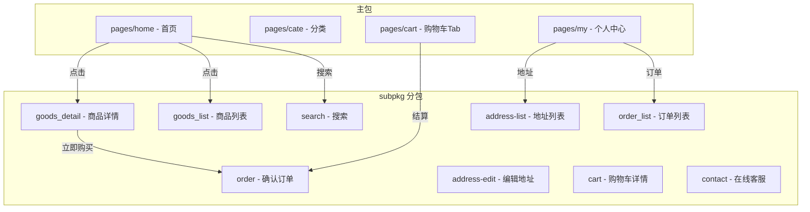
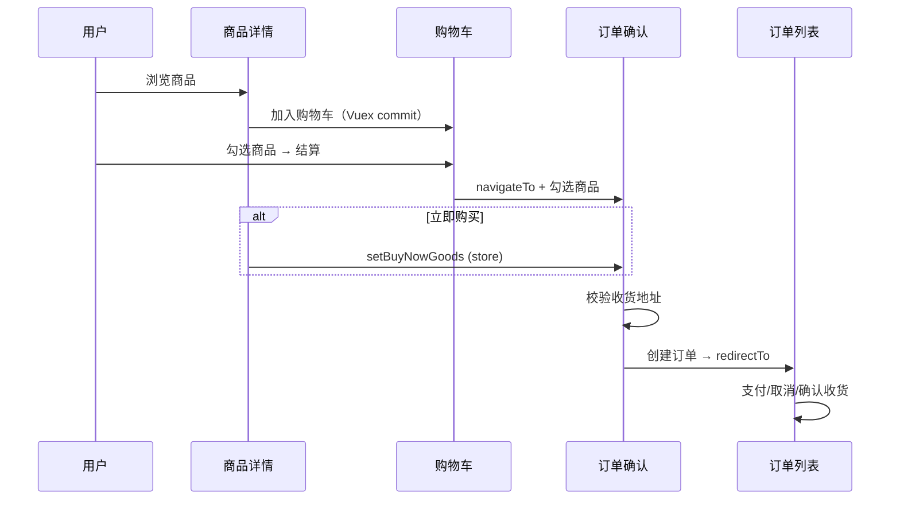
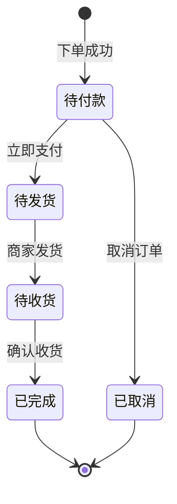

# ☀️ Sunny优购 (Sunny Yougou)

[](https://uniapp.dcloud.io/)
[](https://vuejs.org/)
[](https://developers.weixin.qq.com/miniprogram/dev/framework/)
[](https://opensource.org/licenses/ISC)
[](https://github.com/MrYangMrYangMrYang/uni_shop/actions/workflows/ci.yml)
[](https://vitest.dev/)

> 一款基于 **Uni-app** 框架开发的移动端电商微信小程序，实现完整的购物流程

---

## 📖 项目简介

`Sunny优购` 是一款功能完整的电商微信小程序，采用经典的电商布局设计。项目实现了从**商品浏览、搜索、分类**到**购物车管理、收货地址管理、订单支付及在线客服**的完整购物流程，为用户提供流畅便捷的移动端购物体验。

### ✨ 核心亮点

- 🚀 **跨平台兼容**：基于 Uni-app 开发，可编译至微信小程序、H5、App 等多个平台
- ⚡ **性能优化**：分包加载策略 + 瀑布流布局 + 吸顶效果，显著提升用户体验
- 🔐 **安全可靠**：Token 机制登录 + 微信原生接口集成
- 🎨 **交互丰富**：二级联动导航、滑动删除、实时搜索建议等

---

## 🚀 项目特性

### 跨平台与性能

- **跨平台兼容**：基于 Uni-app 开发，可编译至微信小程序、H5、App 等多个平台
- **分包加载优化**：核心 TabBar 页面位于主包，搜索、详情、订单等功能模块位于 `subpkg` 分包，显著提升首屏加载速度

### 高性能交互体验

- **瀑布流布局**：商品列表采用左右双列瀑布流展示，视觉体验更佳
- **二级联动**：分类页面实现左侧导航与右侧内容的流畅联动
- **吸顶效果**：搜索框在首页及搜索页支持粘性定位

### 状态管理与数据持久化

- 通过 **Vuex** 实现购物车状态、用户信息、收货地址的全局共享与持久化存储
- 模块化状态管理：`m_cart`（购物车）、`m_user`（用户信息）

### 微信深度集成

- ✅ 支持 **微信一键登录**（Token 机制）
- ✅ 对接 **微信原生收货地址** 接口
- ✅ 模拟 **微信支付** 完整流程
- ✅ 内置 **在线客服** 聊天系统

---

## 📌 功能边界说明

> 本项目为**前端求职展示项目**，聚焦前端工程化与交互实现。以下模块为演示性质或受后端接口限制，并非完整生产实现。面试官可据此准确评估项目完成度。

### 🟡 演示性质功能

| 模块         | 实现状态     | 说明                                                                                                                                                                                                    |
| ------------ | ------------ | ------------------------------------------------------------------------------------------------------------------------------------------------------------------------------------------------------- |
| 微信支付     | 流程演示     | [my-settle.vue](./components/my-settle/my-settle.vue) 中的 `payOrder` 方法完整实现了"创建订单 → 获取预支付参数 → 发起微信支付 → 验证支付结果"四步流程，但因后端接口需商户号配置，未在结算按钮中实际调用 |
| 物流查询     | Mock 数据    | [order_list.vue](./subpkg/order_list/order_list.vue) 中的物流详情为前端写死的演示数据，未对接物流接口                                                                                                   |
| 客服系统     | 自动回复模拟 | [contact.vue](./subpkg/contact/contact.vue) 通过 setTimeout 模拟客服回复，未接入 IM SDK                                                                                                                 |
| 商品规格选择 | UI 演示      | 商品详情页未实现 SKU 多维规格选择                                                                                                                                                                       |
| 地区选择     | 微信原生     | [address-edit.vue](./subpkg/address-edit/address-edit.vue) 使用微信原生 `<picker mode="region">` 组件                                                                                                   |
| 个人中心统计 | 假数据       | [my-userinfo.vue](./components/my-userinfo/my-userinfo.vue) 顶部"收藏店铺/收藏商品/关注商品/足迹"数字为写死演示值                                                                                       |

### 🟠 环境限制说明

- **登录 Token**：[my-login.vue](./components/my-login/my-login.vue) 因演示环境后端接口限制，使用硬编码测试 Token。生产环境应替换为接口返回的真实 Token，并配合 `utils/request.js` 的 401 拦截器实现自动续期
- **API 地址**：使用 itheima 商城公开测试接口，仅供学习演示，请勿用于生产
- **manifest.json** 中 `urlCheck: false` 仅用于开发调试，生产环境必须开启

### 🟢 完整闭环功能

以下功能为**真实可用**的完整业务闭环：

- 商品浏览（首页楼层、分类二级联动、商品列表瀑布流、商品详情）
- 购物车（增删改查、全选、滑动删除、合计计算、本地持久化）
- 收货地址管理（新增、编辑、删除、默认地址排他、微信导入）
- 订单列表（状态分类、支付倒计时、订单生命周期操作）
- 搜索（历史记录、搜索建议、防抖、去重）
- 用户登录（微信授权、Token 持久化、退出登录、登录守卫）

---

## 🛠️ 技术栈

| 技术                                                                                     | 版本/说明  | 用途                      |
| ---------------------------------------------------------------------------------------- | ---------- | ------------------------- |
| [Uni-app](https://uniapp.dcloud.io/)                                                     | Vue.js 2.x | 核心开发框架              |
| [Vuex](https://vuex.vuejs.org/)                                                          | 3.x        | 全局状态管理 + 自研持久化 |
| [@escook/request-miniprogram](https://www.npmjs.com/package/@escook/request-miniprogram) | ^0.2.1     | 网络请求封装              |
| SCSS (Sass)                                                                              | -          | 70+ 变量设计系统          |
| uni-ui                                                                                   | -          | UI 组件库基础             |
| [Vitest](https://vitest.dev/)                                                            | ^1.0       | 单元测试框架              |
| [ESLint](https://eslint.org/) + [Prettier](https://prettier.io/)                         | ^8 + ^3    | 代码规范 + 格式化         |
| [husky](https://typicode.github.io/husky/) + [commitlint](https://commitlint.js.org/)    | ^8 + ^18   | Git hooks + 提交规范      |
| [GitHub Actions](https://github.com/features/actions)                                    | -          | CI 自动 lint + test       |

---

## 📦 核心功能模块

### 1️⃣ 首页 (Home)

- **轮播图展示**：动态运营位，支持自动轮播
- **分类导航**：快捷入口直达商品分类
- **楼层推荐**：精选商品分模块展示

### 2️⃣ 商品分类 (Category)

- **左右联动导航**：左侧分类列表 + 右侧商品内容
- **点击定位**：支持快速定位到指定分类

### 3️⃣ 搜索系统 (Search)

- **实时联想**：输入关键词实时显示建议（防抖处理）
- **搜索历史**：本地存储历史记录，支持一键清空
- **热门推荐**：展示热门搜索关键词

### 4️⃣ 购物流程 (Shop Flow)

#### 商品详情页

- 富文本渲染商品详情
- 图片大图预览功能
- 多规格选择下单

#### 购物车

- 左滑删除商品（uni-swipe-action）
- 商品数量调整（uni-number-box）
- 全选/反选计算总价
- TabBar 实时徽标同步

#### 地址管理系统

- 手动编辑收货地址
- 微信导入收货地址（一键获取）

#### 订单系统

- 订单确认与下单
- 订单列表分页加载
- 订单状态流转（待付款/待发货/待收货/已完成）

### 5️⃣ 在线客服 (Contact)

- **即时通讯**：模拟客服自动回复系统
- **智能导购**：提供贴心的购物咨询服务

---

## 🏗️ 架构设计

### 分包结构



### 购物流程时序



### 订单状态机



---

## 🔦 技术亮点

> 面试官最关心的 5 个技术决策，逐一说明

### 1. 网络层架构

基于 `@escook/request-miniprogram` 二次封装，补齐了 6 项企业级能力：

| 能力             | 实现                                                        |
| ---------------- | ----------------------------------------------------------- |
| Token 自动注入   | `beforeRequest` 拦截器，`/my/` 路径自动携带 Authorization   |
| 401 自动跳登录   | `afterRequest` 拦截器 + 防抖（5s 超时自动复位）             |
| Loading 引用计数 | 并发请求共享一个 loading，最后完成才关闭                    |
| 错误码映射       | 400/401/403/404/500/502/503/504 → 用户友好文案              |
| 超时提示         | 网络超时/断网分别给出针对性提示                             |
| API 分层         | `api/home.js` / `api/goods.js` / `api/user.js` 按业务域组织 |

### 2. 自研持久化插件

替代每个模块手写 `saveXxxToStorage` 的样板代码，通过 Vuex plugin + `store.subscribe` 实现声明式持久化：

```javascript
// store/store.js — 一行配置替代 6 个存储函数
createPersistedState({
	paths: {
		'm_cart.cart': 'cart',
		'm_user.token': 'token'
		// ...
	}
});
```

初始化时自动从 Storage 恢复到 state，mutation 命中时自动写入 Storage。

### 3. 骨架屏体系

3 种模式（list/card/detail）× 4 个核心页面（home/cate/goods_list/goods_detail），shimmer 动画 + SCSS 变量统一管理。

### 4. 购物车双页一致性

`pages/cart`（TabBar）和 `subpkg/cart`（内部跳转）共享同一 Vuex store，删除确认、Toast 反馈、商品交互逻辑完全一致。

### 5. 性能优化 TODO → DONE

| 优化项             | 实施                                           |
| ------------------ | ---------------------------------------------- |
| 首页三接口并发     | `await Promise.all([...])` 替换 3 个串行 await |
| 订单定时器按需启停 | 仅 `status===0` 订单存在时运行 `setInterval`   |
| 图片懒加载         | `u-image` 组件默认 `lazy-load="true"`          |

---

## ❓ 面试 FAQ

<details>
<summary><b>为什么用 Vue 2 而不是 Vue 3？</b></summary>

本项目基于 **Uni-app** 框架开发。在项目启动时（2024 年初），Uni-app 的 Vue3 支持尚在完善中，Vue2 生态更稳定、插件兼容性更好。同时，掌握 Options API → Composition API 的迁移也是面试中的加分表达。

✅ 已在计划中：Vue3 + `<script setup>` + composables 迁移。

</details>

<details>
<summary><b>为什么用 Vuex 而不是 Pinia？</b></summary>

Vuex 3.x 是 Vue 2 生态的标准状态管理方案。自研的持久化插件正是基于 Vuex plugin 机制实现的——这恰好展示了"理解原理"而非"只会用工具"的深度。

✅ Pinia 迁移已列入计划。

</details>

<details>
<summary><b>网络层解决了什么问题？</b></summary>

在 `@escook/request-miniprogram` 基础上补齐了 **Token 自动注入**、**401 拦截跳登录**、**全局 loading 引用计数**、**错误码 → 用户文案映射** 四项能力。详见上方"技术亮点"第 1 点。

</details>

<details>
<summary><b>这个项目最大的技术难点是什么？</b></summary>

**自研持久化插件**：需要在 Vuex plugin 中处理嵌套 state 路径的读写，同时保证初始化恢复 → mutation 触发 → Storage 写入的链路正确。难点在于：

1. 嵌套路径的 get/set（`m_cart.cart` → `state.m_cart.cart`）
2. 初始化时 Storage 数据合并到现有 state 的时机
3. mutation 命中后只写变更字段而非全量写入

</details>

<details>
<summary><b>如何保证代码质量？</b></summary>

- **ESLint + Prettier**：0 errors, 0 warnings
- **husky + commitlint**：commit 自动校验格式 + 规范提交信息
- **GitHub Actions**：Push → 自动 lint:check + format:check + vitest run
- **Vitest**：4 spec / 33 用例，mock uni/wx 全局 API
- **条件编译 ESLint 插件** `eslint-plugin-uni-conditional`：自研，处理 uni-app 的 `#ifdef VUE3` / `#endif` 编译指令

</details>

---

## 📸 项目截图

> 微信开发者工具中预览效果最佳。截图存放于 `docs/screenshots/`。

| 首页           | 分类           | 商品详情       |
| -------------- | -------------- | -------------- |
| _(截图待补充)_ | _(截图待补充)_ | _(截图待补充)_ |

| 购物车         | 订单列表       | 个人中心       |
| -------------- | -------------- | -------------- |
| _(截图待补充)_ | _(截图待补充)_ | _(截图待补充)_ |

### 体验方式

1. **微信开发者工具**：导入项目 → 编译运行
2. **HBuilderX**：打开项目 → 运行 → 微信小程序模拟器
3. **H5 在线预览**：(部署后补充链接)

---

## 📂 目录结构

```text
uni_shop/
├── components/              # 业务自定义组件
│   ├── my-address/         # 收货地址组件
│   ├── my-goods/           # 商品组件
│   ├── my-login/           # 登录组件
│   ├── my-search/          # 搜索组件
│   ├── my-settle/          # 结算组件
│   ├── my-userinfo/        # 用户信息组件
│   ├── uni-goods-nav/      # 商品导航组件
│   ├── uni-icons/          # 图标组件
│   ├── uni-number-box/     # 数字输入框组件
│   ├── uni-search-bar/     # 搜索栏组件
│   ├── uni-swipe-action/   # 滑动操作组件
│   └── uni-tag/            # 标签组件
├── mixins/                  # 逻辑混入
│   └── tabbar-badge.js     # TabBar 购物车角标混入
├── pages/                   # 主包页面（TabBar 页面）
│   ├── home/               # 首页
│   ├── cate/               # 分类页
│   ├── cart/               # 购物车页
│   └── my/                 # 个人中心页
├── subpkg/                  # 分包页面
│   ├── address-edit/       # 编辑地址
│   ├── address-list/       # 地址列表
│   ├── cart/               # 购物车详情
│   ├── contact/            # 在线客服
│   ├── goods_detail/       # 商品详情
│   ├── goods_list/         # 商品列表
│   ├── order/              # 订单确认
│   ├── order_list/         # 订单列表
│   └── search/             # 搜索页
├── store/                   # Vuex 状态管理
│   ├── cart.js             # 购物车状态模块
│   ├── store.js            # Store 入口
│   └── user.js             # 用户状态模块
├── static/                  # 静态资源
│   ├── my-icons/           # 自定义图标
│   └── tab_icons/          # TabBar 图标
├── App.vue                  # 应用入口（全局生命周期 & 样式）
├── main.js                  # 主入口文件（全局配置）
├── pages.json               # 页面路由配置
├── manifest.json            # 应用配置（AppID、权限等）
├── package.json             # 项目依赖配置
└── uni.scss                 # 全局 SCSS 变量
```

---

## 🏃 快速开始

### 环境要求

- **Node.js**: >= 12.0.0
- **HBuilderX**: 最新版本（推荐）
- **微信开发者工具**: 最新版本
- **npm / yarn / pnpm**: 包管理器

### 安装步骤

#### 1. 克隆项目

```bash
# 使用 Git 克隆
git clone https://github.com/MrYangMrYangMrYang/uni_shop.git

# 进入项目目录
cd uni_shop
```

#### 2. 安装依赖

```bash
# 使用 npm
npm install

# 或使用 yarn
yarn install

# 或使用 pnpm
pnpm install
```

#### 3. 配置开发环境

1. 使用 **HBuilderX** 打开项目文件夹
2. 配置微信开发者工具路径：
   - `工具` -> `设置` -> `运行配置` -> `微信开发者工具路径`
3. 在 `manifest.json` 中配置微信小程序 AppID（如需真机调试）

#### 4. 运行项目

```bash
# 方式一：通过 HBuilderX 运行
# 点击菜单：运行 -> 运行到小程序模拟器 -> 微信开发者工具

# 方式二：通过 CLI 运行（需安装 cli）
# 运行到微信开发者工具
npm run dev:mp-weixin
```

> ⚠️ **注意**：请在微信开发者工具中开启"不校验合法域名、web-view（业务域名）、TLS版本以及 HTTPS 证书"

---

## ⚙️ 项目配置说明

### 微信小程序配置 ([manifest.json](manifest.json))

| 配置项               | 值                 | 说明                     |
| -------------------- | ------------------ | ------------------------ |
| appid                | wx59a05d819ac54ff8 | 微信小程序 AppID         |
| urlCheck             | false              | 关闭域名校验（开发环境） |
| lazyCodeLoading      | requiredComponents | 按需注入组件             |
| requiredPrivateInfos | chooseAddress      | 申请收货地址权限         |

### 网络请求超时配置

- request: 60s
- connectSocket: 60s
- uploadFile: 60s
- downloadFile: 60s

---

## 📝 开发指南

### 状态管理 (Vuex)

项目使用 Vuex 进行全局状态管理，主要包含两个模块：

#### 购物车模块 ([store/cart.js](store/cart.js))

- 商品列表管理
- 选中状态控制
- 总价计算
- 本地持久化

#### 用户模块 ([store/user.js](store/user.js))

- Token 存储
- 用户信息管理
- 收货地址管理

### 网络请求封装

使用 `@escook/request-miniprogram` 封装网络请求：

- ✅ 请求拦截器：自动添加 Token
- ✅ 响应拦截器：统一错误处理
- ✅ 请求超时处理

### 自定义组件说明

所有业务组件位于 [components/](components/) 目录，遵循 Uni-app 组件规范：

- **my-***: 业务逻辑组件（登录、地址、结算等）
- **uni-***: 基础UI组件（图标、标签、数字框等）

---

## ❓ 常见问题 (FAQ)

<details>
<summary><b>🔧 如何解决依赖安装失败？</b></summary>

1. 清除缓存后重试：

   ```bash
   npm cache clean --force
   rm -rf node_modules package-lock.json
   npm install
   ```

2. 切换镜像源：

   ```bash
   npm config set registry https://registry.npmmirror.com
   ```

3. 使用其他包管理器（yarn/pnpm）

</details>

<details>
<summary><b>⚠️ 微信开发者工具报错怎么办？</b></summary>

1. **检查 AppID 配置**：确保 `manifest.json` 中的 appid 正确
2. **关闭域名校验**：在微信开发者工具 -> 详情 -> 本地设置中勾选"不校验..."
3. **重新编译**：点击"编译"按钮重新加载项目
4. **清除缓存**：工具 -> 清除全部缓存

</details>

<details>
<summary><b>📱 如何切换到其他平台？</b></summary>

在 HBuilderX 中：

1. 点击 `运行` -> `运行到浏览器` （H5）
2. 或 `发行` -> `原生App-云打包` （App）
3. 详细文档参考：[Uni-app 多端发布指南](https://uniapp.dcloud.io/tutorial/platform)

</details>

---

## 🤝 贡献指南

欢迎提交 Issue 和 Pull Request 来改进本项目！

### 提交规范

- feat: 新功能
- fix: 修复问题
- docs: 文档更新
- style: 代码格式调整
- refactor: 重构代码
- test: 测试相关
- chore: 构建/工具相关

### 开发流程

1. Fork 本仓库
2. 创建特性分支 (`git checkout -b feature/AmazingFeature`)
3. 提交更改 (`git commit -m 'Add some AmazingFeature'`)
4. 推送到分支 (`git push origin feature/AmazingFeature`)
5. 打开 Pull Request

---

## 📄 开源协议

本项目采用 [ISC License](https://opensource.org/licenses/ISC) 协议开源。

```
Copyright (c) 2024 Sunny优购

Permission to use, copy, modify, and/or distribute this software for any
purpose with or without fee is hereby granted, provided that the above
copyright notice and this permission notice appear in all copies.
```

---

## 🙏 致谢

- [DCloud](https://www.dcloud.io/) - 提供 Uni-app 开发框架
- [Vue.js](https://vuejs.org/) - 渐进式 JavaScript 框架
- [Escook](https://github.com/escook) - 提供 request-miniprogram 库
- [uni-ui](https://uniapp.dcloud.io/component/uniui/uni-ui.html) - UI 组件库

---

## 📮 联系方式

- 💬 **Issue**: [提交问题](https://github.com/MrYangMrYangMrYang/uni_shop/issues)
- 📧 **邮箱**: [GitHub Issues](https://github.com/MrYangMrYangMrYang/uni_shop/issues)
- 🌐 **项目地址**: [GitHub 仓库](https://github.com/MrYangMrYangMrYang/uni_shop)

---

<div align="center">

**如果这个项目对你有帮助，请给一个 ⭐ Star 支持一下！**

Made with ❤️ by Sunny Yang

</div>
